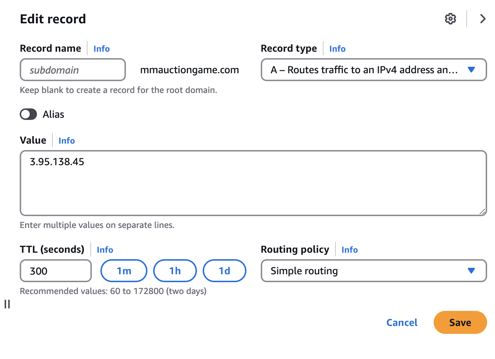
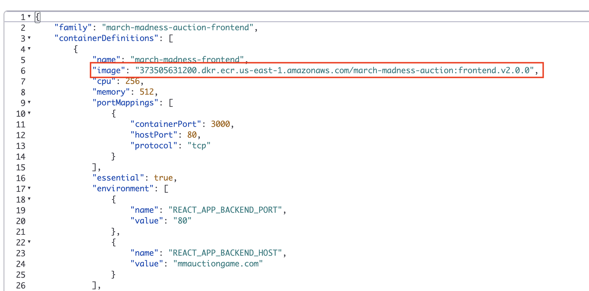

# March Madness Auction


## Getting Started

Docker based development and setup.

To build the project:

```bash
docker compose build
```

## Local Development

Install dev packages
``` pip install -r requirements-dev.txt```

Install pre-commit hooks
```pre-commit install```
This will create a hook file at `.git/hooks/pre-commit.`

[pre-commit documentation](https://pre-commit.com/)

pre-commit will run against all staged files when you run `git commit`
To run pre-commit against all files run
```pre-commit run --all-files```


## Usage

```bash
./dev_start.sh
```
This will start a tmux session with two panes. Each pane corresponds to a container. Log output will print here.

The directories are mounted and the containers automatically refresh changes on write.

```bash
docker compose exec frontend /bin/bash
```

The above command will allow you to attach to the shell of a running container. This will be useful if you need to install packages. npm will automatically track the installed packages, but python will not. Ensure that you place python packages in ```backend/requirements.txt```.

You can also use VSCode for development. Once the containers are running, you can use the container and docker plugins to attach to the running containers.

## Deploying

Make sure autoscaling group (Infra-ECS-Cluster-march-madness-auction) is configured to have at least 1 instance

Change route53 record to point to the public ip of the ec2 instance


Cut release from github

Get tag arn from [registry](https://us-east-1.console.aws.amazon.com/ecr/repositories/private/373505631200/march-madness-auction?region=us-east-1)


Deploy new revision of task definition of both frontend and backend with latest tags


Export latest revision number
`export revision=<latest-here>`

Kill running tasks
`aws ecs list-tasks --cluster march-madness-auction --query "taskArns[]" --output text | xargs -n1 aws ecs stop-task --cluster march-madness-auction --task`

Force new deployment with latest version
```aws ecs update-service --cluster march-madness-auction --service march-madness-auction-backend --task-definition march-madness-auction-backend:$revision --force-new-deployment && aws ecs update-service --cluster march-madness-auction --service march-madness-auction-frontend --task-definition march-madness-auction-frontend:$revision --force-new-deployment```
